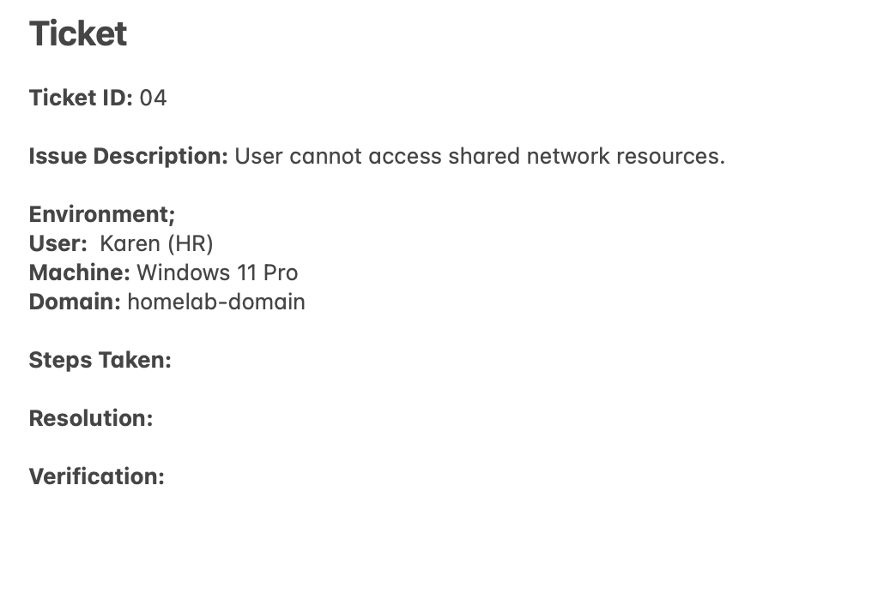
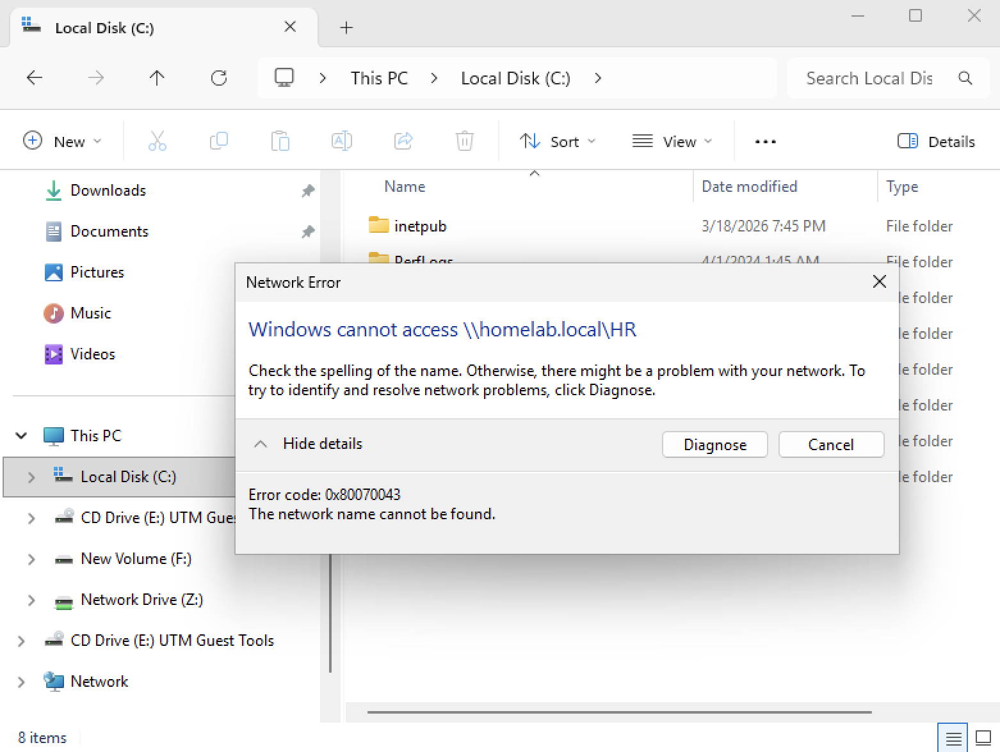
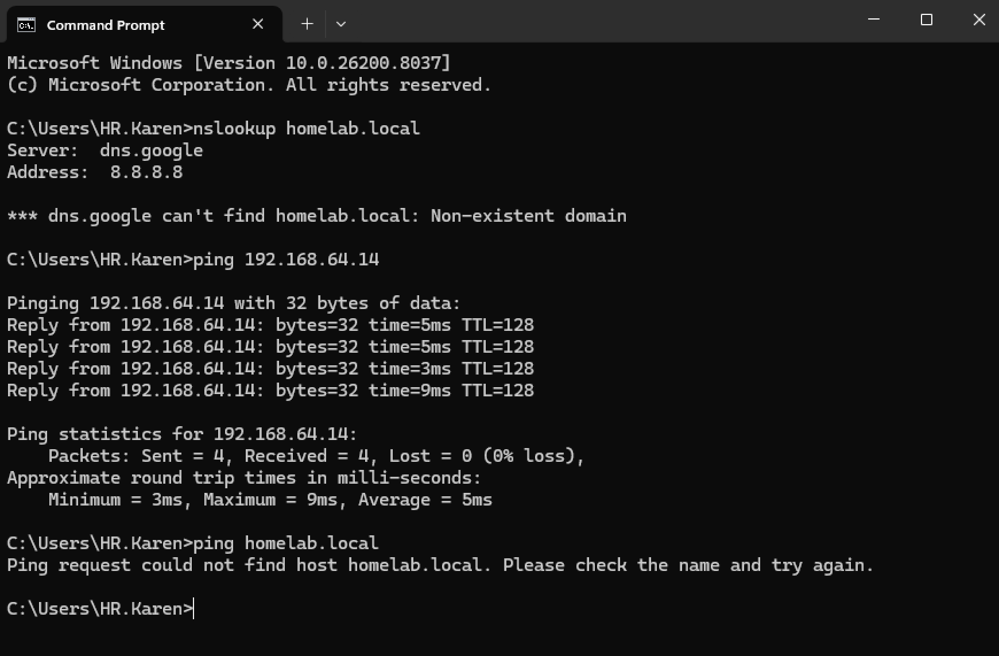
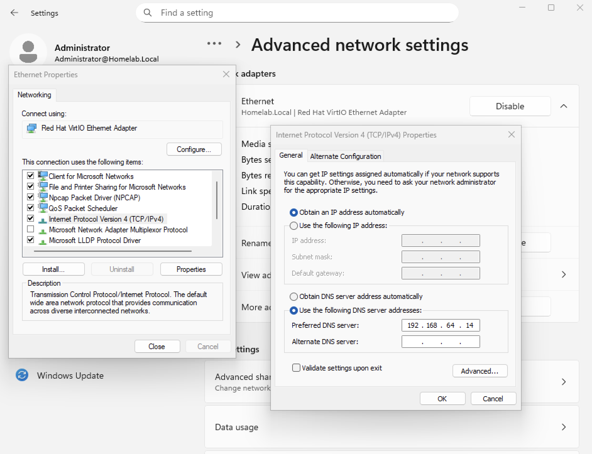
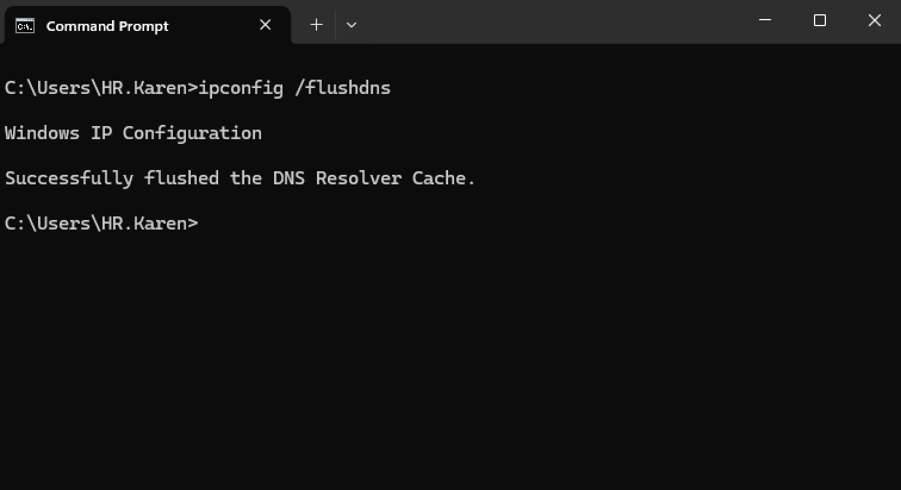
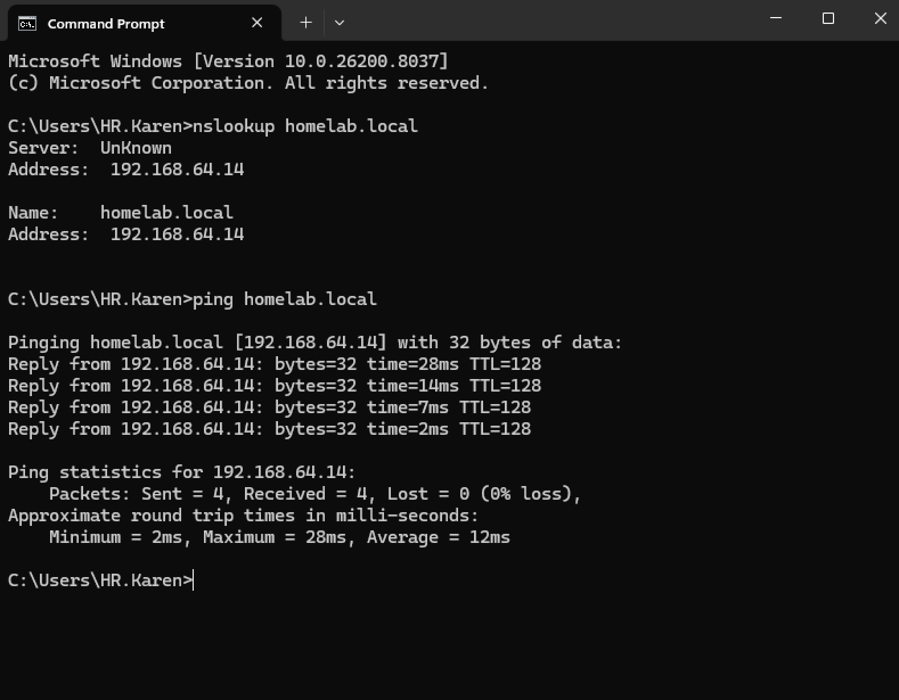
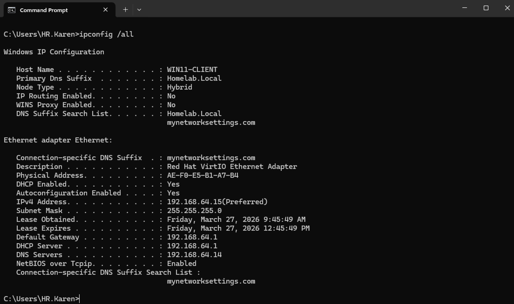
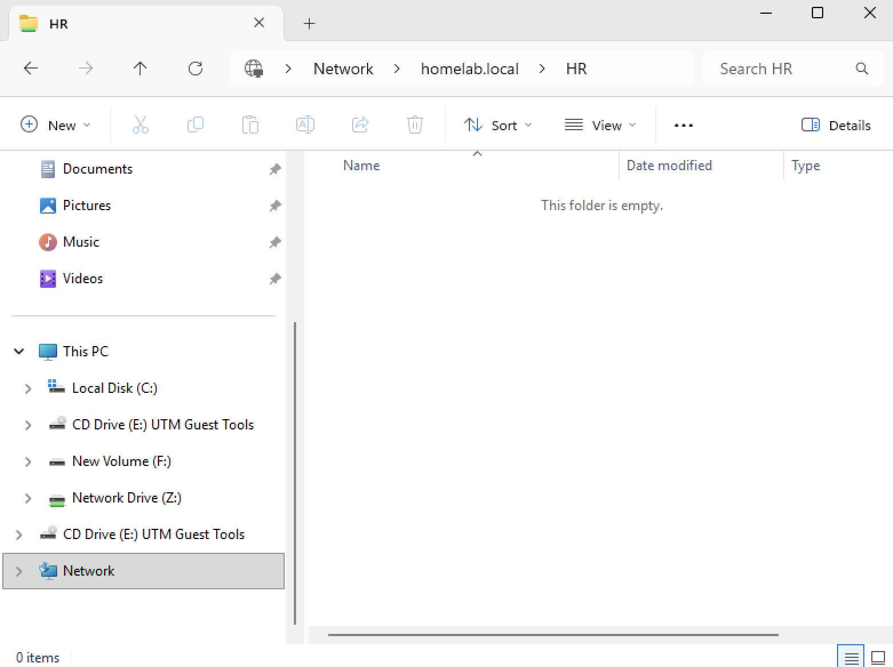
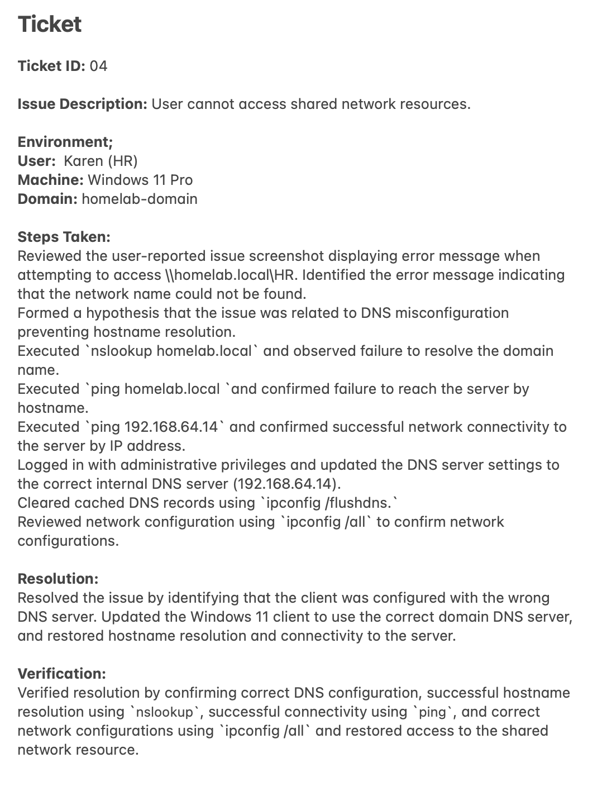

# Connectivity Issue with DNS Troubleshooting Lab

## Objective 
Simulate and troubleshoot a real-world IT support scenario where a client-to-server connectivity issue caused by incorrect DNS configuration on a domain-joined Windows 11 machine. Use Windows networking tools to identify the root cause, restore name resolution, and verify successful connectivity to the server.

---

## Lab Environment
- Windows Server 2019 Virtual Machine
- Windows 11 Pro Virtual Machine

---

## Ticket
User attempted to access a shared folder `\\homelab.local\HR` from their workstation. Shared folder couldn't be located. Support ticket has been received. 



---

## Steps

### 1. Identified the Problem
User sent screenshot of when attempting to access shared folder, error message displaying `The network name cannot be found`.



---

### 2. Established a Theory of Probable Cause
Formed a hypothesis that incorrect DNS configuration is preventing the workstation from resolving the server hostname `homelab.local`, resulting in loss of access to network resources.

---

### 3. Tested the Theory
Performed network troubleshooting commands to validate the hypothesis. The client failed to resolve the server hostname using `nslookup`, while direct communication to the server IP address using `ping` was successful. This confirmed that the issue was related to DNS resolution rather than network connectivity. 

**Command Used**
```
nslookup homelab.local
```
```
ping 192.168.64.14
```
```
ping homelab.local
```



---

### 4. Established a Plan of Action and Implemented the Solution
Established a plan to correct the DNS configuration by updating the client to use the internal domain DNS server and clear cached DNS records using `ipconfig`. Logged on workstation with Administrator credentials to perform the DNS configuration. Opened Settings → Network & Internet → Advanced Network Settings → Ethernet drop down → More Adapter Options → Internet Protocol Version 4 (TCP/IPv4) Properties and changed Preferred DNS Server from `8.8.8.8` to `192.168.64.14` (domain controller). 

**Command Used**
```
ipconfig /flushdns
```





---

### 5. Verified Full System Functionality
Verified by confirming hostname resolution through `nslookup`, restored communication to the server using `ping`, and reviewed network configurations with `ipconfig` User successfully had access to the shared folder. 

**Command Used**
```
nslookup homelab.local
```

```
ping homelab.local
```

```
ipconfig /all
```







---

### 6. Documented Findings, Actions and Outcomes.
Documented the issue, troubleshooting steps, resolutions and verification results in the support ticket for future reference and auditing. Ticket closed.



### Key Takeaways
- DNS misconfiguration can prevent access to internal resources even when network connectivity is fully functional.
- Verifying connectivity by both hostname and IP address is critical for isolating DNS-related issues.
- `nslookup`, `ping`, and `ipconfig /all` are essential tools for identifying and diagnosing name resolution problems.
- Error messages such as “The network name cannot be found” often indicate name resolution issues rather than permission problems.
- Following a structured troubleshooting methodology helps efficiently identify root cause and avoid unnecessary changes.
- Proper verification after implementing a fix ensures the issue is fully resolved and prevents recurrence.